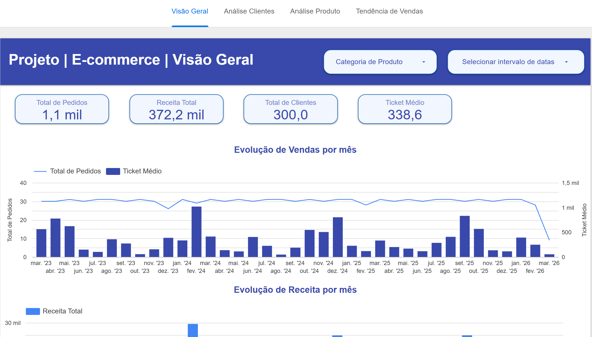

# Ecommerce DBT Project

Este projeto cria um **data warehouse de e-commerce** usando o [dbt (data build tool)](https://docs.getdbt.com/).
Os dados são carregados via **seeds** (CSV) e processados em um **BigQuery**.

---

## **Tabelas Principais**

### **1. customers**
Cadastro de clientes.

| Coluna        | Tipo    | Descrição                |
|---------------|---------|--------------------------|
| customer_id   | INT     | ID único do cliente      |
| name          | STRING  | Nome completo do cliente |
| email         | STRING  | E-mail do cliente        |
| signup_date   | DATE    | Data de cadastro         |

---

### **2. products**
Catálogo de produtos.

| Coluna      | Tipo    | Descrição                     |
|-------------|---------|-------------------------------|
| product_id  | INT     | ID único do produto            |
| name        | STRING  | Nome do produto                |
| category    | STRING  | Categoria do produto           |
| price       | FLOAT   | Preço do produto (em moeda)    |

---

### **3. orders**
Transações realizadas.

| Coluna        | Tipo    | Descrição                                       |
|---------------|---------|-------------------------------------------------|
| order_id      | INT     | ID único do pedido                              |
| customer_id   | INT     | FK para `customers.customer_id`                  |
| product_id    | INT     | FK para `products.product_id`                    |
| order_date    | DATE    | Data da compra                                  |
| total_amount  | FLOAT   | Valor total do pedido                           |

---

## **Relacionamentos**
- `orders.customer_id` → `customers.customer_id`
- `orders.product_id` → `products.product_id`

---

## **Estrutura do Projeto**
```
ecommerce_dbt_project/
├── dbt_project.yml
├── models/
│   ├── staging/
│   └── marts/
├── seeds/
│   ├── customers.csv
│   ├── products.csv
│   └── orders.csv
├── docs/
│   └── dashboard_preview.png
└── README.md
```

---

## **Como Executar**

1. **Instalar o dbt BigQuery**
   ```bash
   pip install dbt-bigquery
   ```

2. **Carregar dados**
   ```bash
   dbt seed --full-refresh
   ```

3. **Rodar modelos**
   ```bash
   dbt run
   ```

4. **Testar Integridade**
   ```bash
   dbt test
   ```

---

## **Dashboard Looker Studio**

Este projeto inclui um dashboard interativo criado no **Looker Studio**, conectado ao BigQuery e alimentado pelo dbt.

- **[Acesse o Dashboard](https://lookerstudio.google.com/reporting/3ef3f274-e2d2-485e-a4d0-43fdc2ca31ac)** .



---

## **Principais Insights**
- Receita total e ticket médio.
- Evolução de vendas ao longo do tempo.
- Produtos mais vendidos e categorias líderes.
- Clientes mais ativos e aquisição mensal.

---

## **Contato**
Criado por **Adilson Batista** – Projeto de estudo com dbt + BigQuery.
